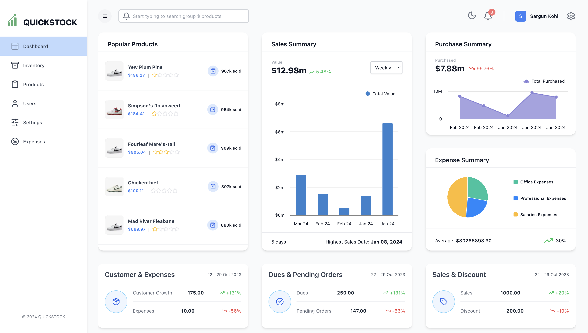
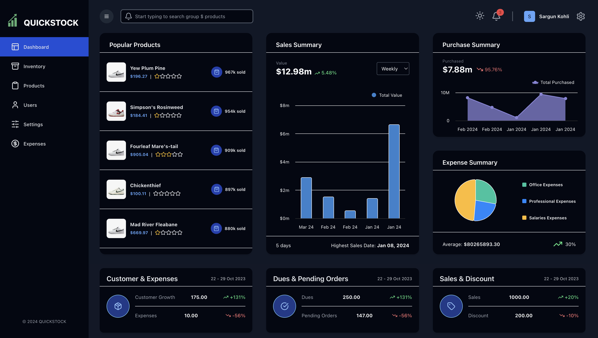
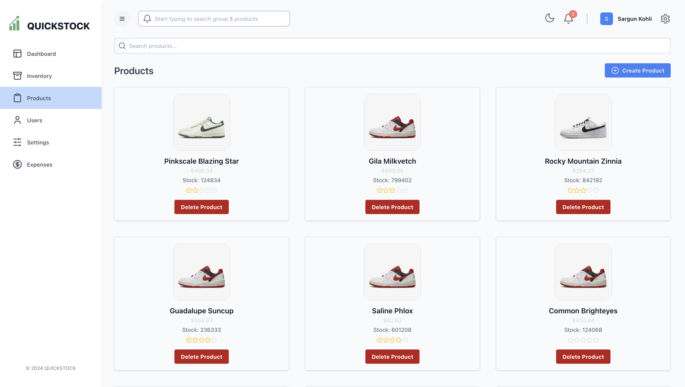
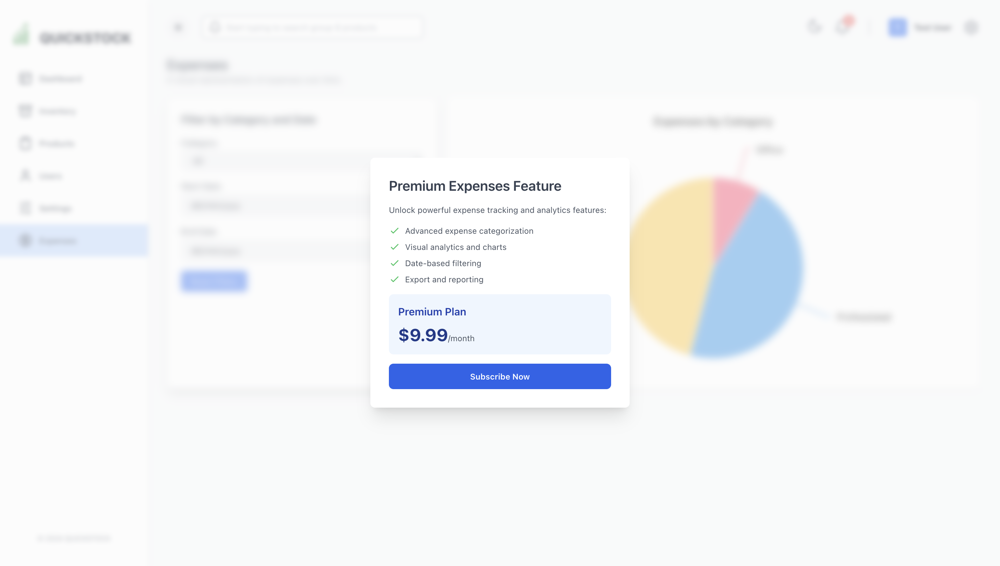

# QuickStock - Inventory Management System

A modern, powerful, and premium-grade inventory management platform engineered to help store owners stay effortlessly in control of their business. It is built with Next.js (frontend), Tailwind (styling), React Highcharts (data visualization), Express/Node.js (backend), PostgreSQL (database), Prisma ORM, and Stripe for payments.

## Deployed Website

- You can checkout and test the deployed website here: [https://inventory-management-frontend-mmub.onrender.comt](https://inventory-management-frontend-mmub.onrender.com)

## Screenshots

## Features

- User authentication
- Product management
- Dark mode support
- Sales, purchases, and expenses tracking
- Optimized API Layer with RTK Query
- Dashboard with analytics
- Stripe subscription integration
- Responsive, modern UI (Next.js + Tailwind)
- Secure, Scalable, and Clean Codebase

## Project Structure

- /client # Next.js frontend
- /server # Express backend

## Contributing

Pull requests are welcome! For major changes, please open an issue first to discuss what you would like to change.

## License

[MIT](LICENSE)

## Questions?

Open an issue or contact [sargun.kohli152@gmail.com](sargun.kohli152@gmail.com)
